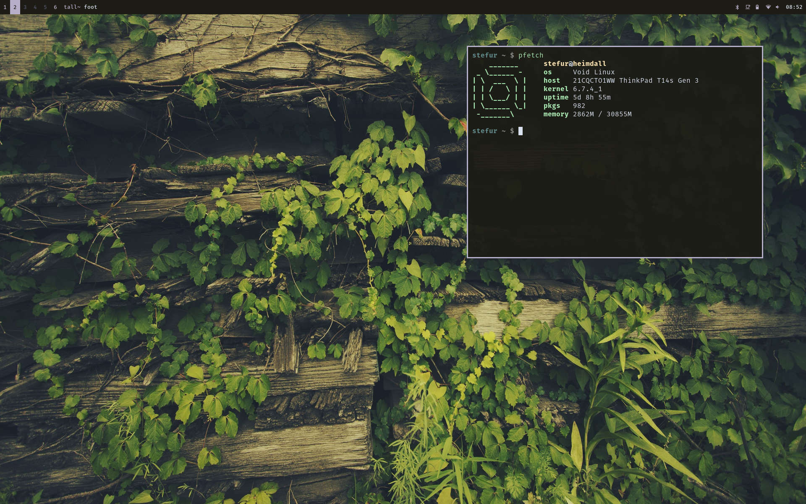

## Qtile configuration
This is my configuration for [Qtile](https://github.com/qtile/qtile). It's geared towards Wayland and used with Waybar.
If you're interested in xorg related stuff, check this [branch](https://github.com/stefur/qtile-config/tree/xorg).



## Features
- [Spawn or focus application](#spawn-or-focus-application)
- [Focus browser if urgent](#focus-browser-if-urgent)
- [Simple layout toggle](#simple-layout-toggle)
- [Fallback to default layout](#fallback-to-default-layout)
- [Send group status to Waybar](#send-group-status-to-waybar)
- [Send window title to Waybar](#send-window-title-to-waybar)
- [Send current layout to Waybar](#send-current-layout-to-waybar)

### Spawn or focus application
Also sometimes known as "*run or raise*" in other tiling window managers, such as Xmonad. The basic idea is to check if an application is already running before it's spawned. If it's running, focus the window.

The method to spawn or focus is the following:

```python
from libqtile import qtile

def spawn_or_focus(self: Qtile, app: str) -> None:
    """Check if the app being launched is already running, if so focus it"""
    window = None
    for win in self.windows_map.values():
        if isinstance(win, Window):
            wm_class: list | None = win.get_wm_class()
            if wm_class is None or win.group is None:
                return
            if any(item.lower() in app.lower() for item in wm_class):
                window = win
                group = win.group
                group.toscreen(toggle=False)
                break

    if window is None:
        self.spawn(app)
```

What happens here is that we try to find any already open window of the application by looking up all the open windows. Specifically we try to match the app with `wm_class` for each window.

In the event of a window match we find the group on which its on and move there. When that's done we move the group to the screen.

Should no match be found, and window remains `None`, it will instead spawn the app.

In the keybinds the above method can be used as:
```python
Key("mod4", "c", lazy.function(spawn_or_focus, "signal-desktop")),
```

Another behavior that might be desirable is to bring the window to main pane if the window is in the stack, similar to Xmonads `runOrRaiseMaster`. If so, add the following to the above method:

```diff
    if window is None:
        self.cmd_spawn(app)
+
+   elif window == self.current_window:
+           try:
+               assert (
+                   self.current_layout.swap_main is not None
+               ), "The current layout should have swap_main"
+               self.current_layout.swap_main()
+            except AttributeError:
+                return
+        else:
+            self.current_group.focus(window)
```
This does however assume that the MonadTall layout is being used. But with little modification it can easily be adapted and used with other layouts as well.

### Focus browser if urgent  
I don't like when applications take focus whenever they want, and for this reason the window activation is set to `urgent`. 
However I do want to focus the browser whenever a URL is clicked, that's the only exception to the rule in my use case.

```python
@hook.subscribe.client_urgent_hint_changed
def follow_url(client: Window) -> None:
    """If Firefox is flagged as urgent, focus it"""

    wm_class: list | None = client.get_wm_class()

    for item in wm_class:
        match item:
            case item if item.lower() in BROWSER and client.group is not None:
                qtile.current_screen.set_group(client.group)
                client.group.focus(client)
                return
```
In the above case `BROWSER = 'firefox'`.

### Simple layout toggle
Toggle layout by name. Always go back to the default layout.

```python
def toggle_layout(self: Qtile, layout_name: str) -> None:
    """Takes a layout name and tries to set it, or if it's already active back to monadtall"""
    assert (
        self.current_group.screen is not None
    ), "The screen should not be none for the current group"
    screen_rect = self.current_group.screen.get_rect()
    self.current_group.layout.hide()
    if self.current_group.layout.name == layout_name:
        self.current_group.setlayout(layout_names["monadtall"])
    else:
        self.current_group.setlayout(layout_name)
    self.current_group.layout.show(screen_rect)
```

And in the keybinds something like:  
```python
Key("mod4", "m", lazy.function(toggle_layout, layout_names["max"]))
```
### Fallback to default layout
I don't use many different layouts, it's usually just the standard `monadtall`. But when there are many windows on a group I tend to use either `max`or `treetab`. I don't want to manually have to reset the layout after closing all the windows, so instead I use this hook to go back to `monadtall` if there is less than 2 windows open left on the group.

```python
@hook.subscribe.client_killed
def fallback_default_layout(client: Window) -> None:
    """Reset a group to default layout when theres is only one window left"""

    if (
        not isinstance(client, Window)
        or client.group is None
        or client.group.screen != qtile.current_screen
        or client.floating is True
    ):
        return

    try:
        win_count = len(client.group.windows)
    except AttributeError:
        win_count = 0

    if win_count > 1:
        return

    group_name: str = client.group.name
    default_layout_index: int = 0

    qtile.to_layout_index(default_layout_index, group_name)
```

### Send group status to Waybar
```python
class GroupState(Enum):
    EMPTY = 1
    OCCUPIED = 2
    FOCUSED = 3


@hook.subscribe.focus_change
@hook.subscribe.client_killed
@hook.subscribe.client_managed
def update_waybar(*_args) -> None:
    """Update Waybar of open groups and windows"""
    existing_groups = dict.fromkeys(qtile.groups_map.keys(), GroupState.EMPTY)  # type: ignore[attr-defined]

    existing_groups.pop("scratchpad", None)

    current_group: str = qtile.current_screen.group.label  # type: ignore[attr-defined]

    for window in qtile.windows():  # type: ignore[attr-defined]
        if (
            window["wm_class"] is not None
            and window["group"] is not None
            and window["group"] in existing_groups
        ):
            existing_groups[window["group"]] = GroupState.OCCUPIED

    existing_groups[current_group] = GroupState.FOCUSED

    text: str = ""

    for group, status in existing_groups.items():
        match status:
            case GroupState.OCCUPIED:
                text += f"""<span fgcolor='{colors["primary"]}'> {group} </span>"""
            case GroupState.EMPTY:
                text += f"""<span fgcolor='{colors["secondary"]}'> {group} </span>"""
            case GroupState.FOCUSED:
                text += f"""<span fgcolor='{colors["background"]}' bgcolor='{colors["primary"]}' line_height='2'> {group} </span>"""

    with open("/tmp/qtile-groups.txt", "w", encoding="utf-8") as output:
        output.write(text)
        output.close()

    subprocess.call(["pkill -RTMIN+8 waybar"], shell=True)
```

And then in the Waybar config:

```json
"custom/qtile-groups": {
    "exec": "cat /tmp/qtile-groups.txt",
    "interval": "once",
    "signal": 8,
    "tooltip": false
}
```

### Send window title to Waybar

Qtile:
```python
@hook.subscribe.focus_change
def update_window_title_waybar() -> None:
    """Update Waybar of focused window title"""
    window_title: str = (
        "" if qtile.current_window is None else qtile.current_window.name  # type: ignore[attr-defined]
    )

    with open("/tmp/qtile-window-title.txt", "w", encoding="utf-8") as output:
        output.write(f"<span fgcolor='{colors["text"]}'>{window_title}</span>")
        output.close()

    subprocess.call(["pkill -RTMIN+9 waybar"], shell=True)
```

Waybar:
```json
"custom/qtile-window-title": {
    "exec": "cat /tmp/qtile-window-title.txt",
    "interval": "once",
    "signal": 9,
    "max-length": 50,
    "tooltip": false
}
```

### Send current layout to Waybar

Qtile:
```python
@hook.subscribe.startup_complete
@hook.subscribe.layout_change
def update_layout_waybar(*_args) -> None:
    """Update Waybar of current layout"""
    try:
        current_layout = qtile.current_layout.name  # type: ignore[attr-defined]
    except AttributeError:
        current_layout = ""

    with open("/tmp/qtile-layout.txt", "w", encoding="utf-8") as output:
        output.write(f"<span fgcolor='{colors["primary"]}'>{current_layout}</span>")
        output.close()

    subprocess.call(["pkill -RTMIN+7 waybar"], shell=True)
```

Waybar:
```json
"custom/qtile-layout": {
    "exec": "cat /tmp/qtile-layout.txt",
    "interval": "once",
    "signal": 7,
    "tooltip": false
}
```